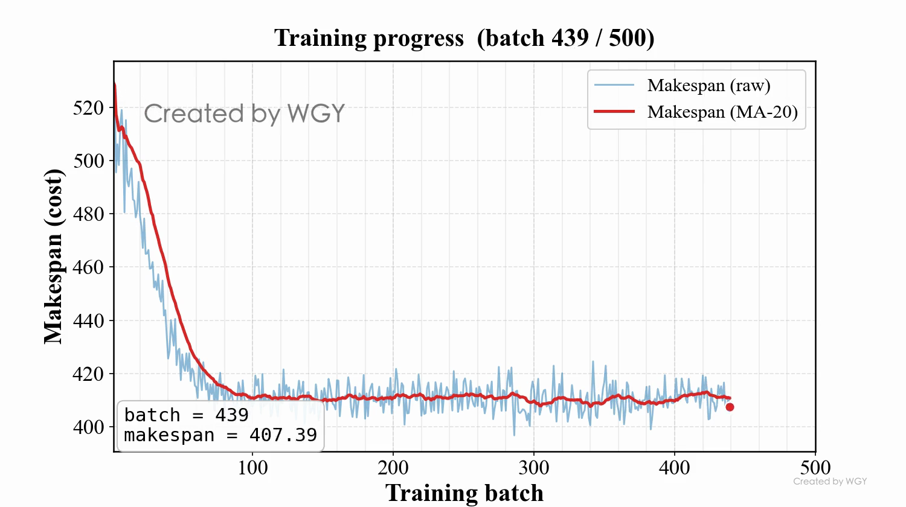
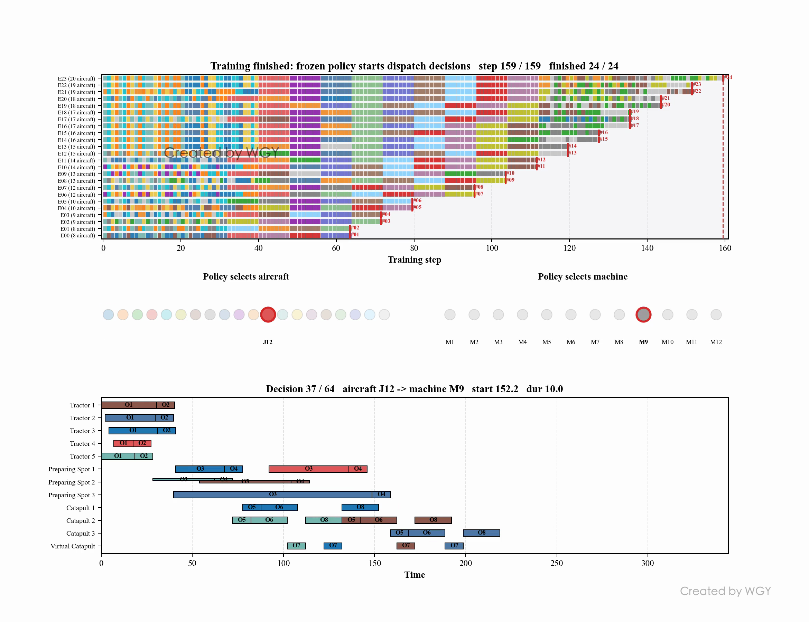
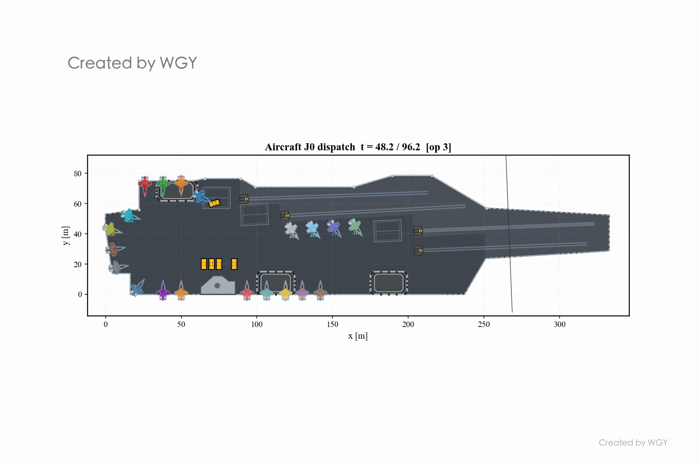
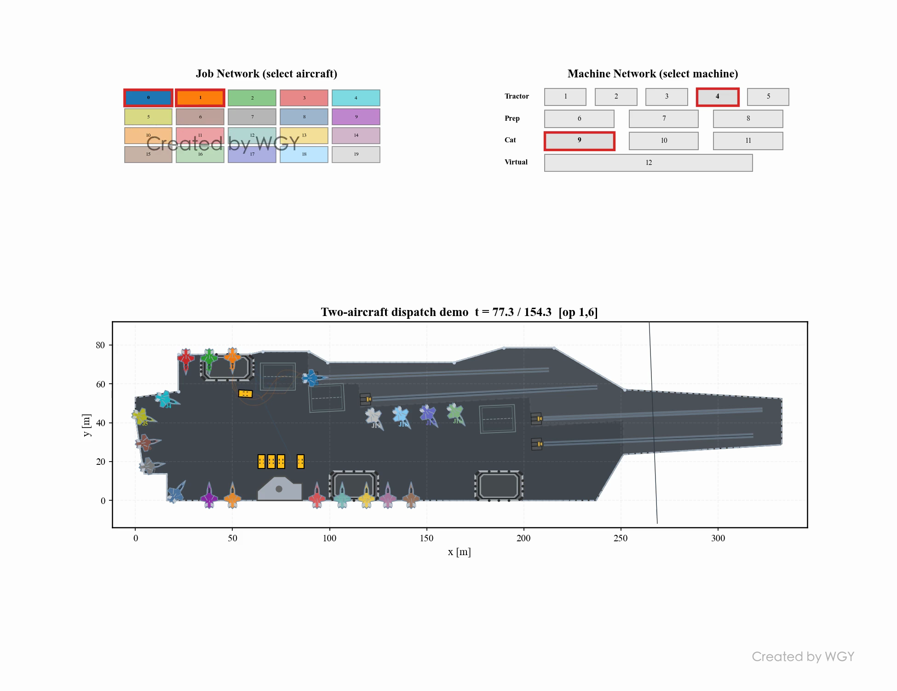
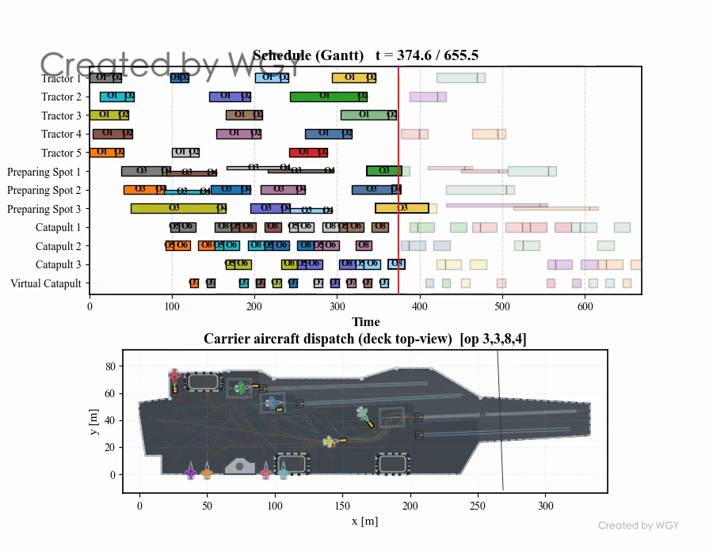
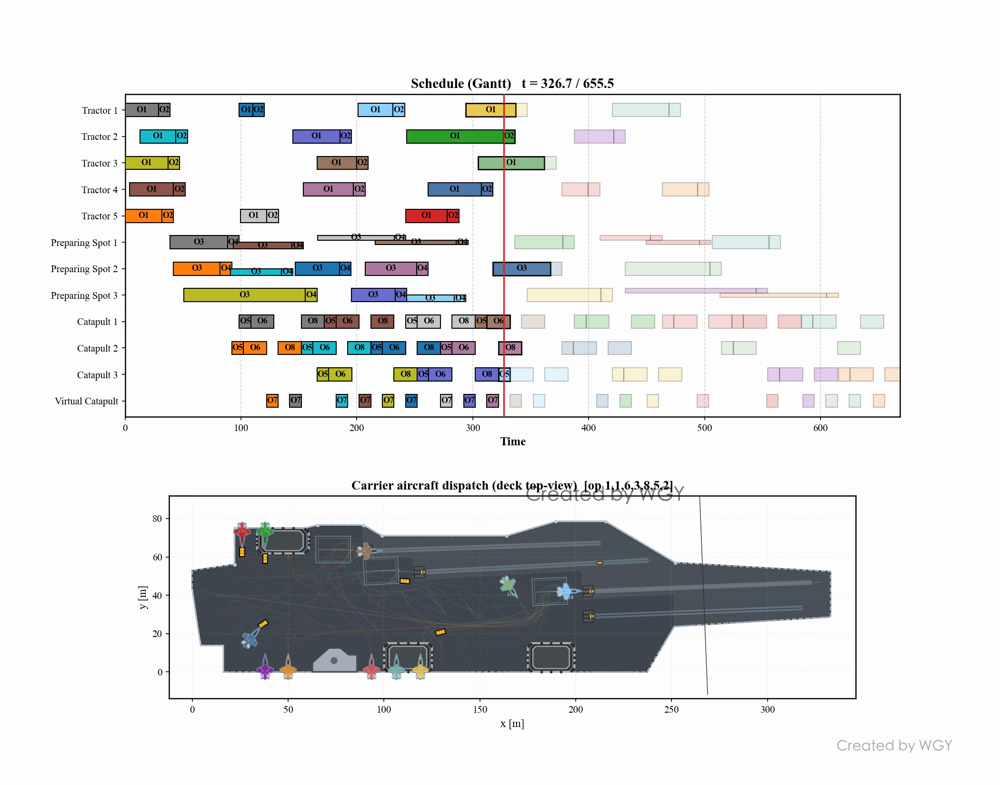
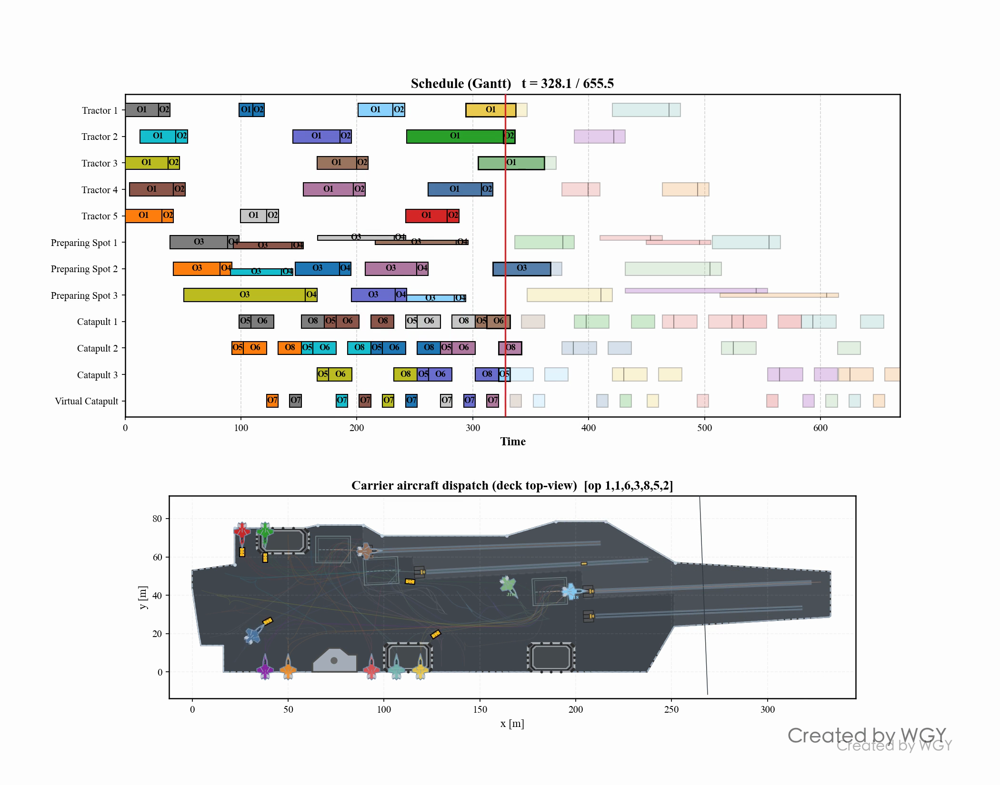
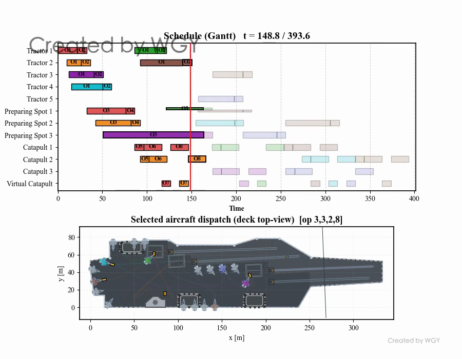
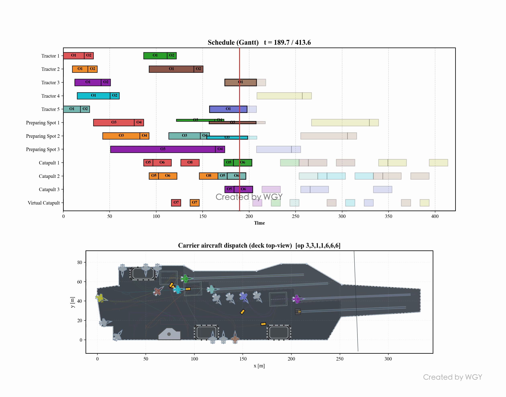

# Sortie

### Complex-Constrained HFSP for Carrier Aircraft Sortie Scheduling

面向复杂约束混合流水车间调度的舰载机出动决策与可视化 
Carrier aircraft sortie scheduling and visualization under complex operational constraints

[**Project repository**](https://github.com/wgy577/Sortie) · [**Watch & download videos**](https://github.com/wgy577/sortie-videos/tree/main/videos)

---

## Overview

Sortie studies carrier-aircraft launch scheduling as a **complex-constrained Hybrid Flow Shop Scheduling Problem (HFSP)**. Aircraft move through ordered operational stages, while each stage may provide multiple parallel resources. The scheduler must coordinate aircraft, tractors, preparation spots, and catapults while respecting precedence, resource-capacity, spatial, and safety constraints.

本项目研究的是带有复杂作业约束的 **HFSP（Hybrid Flow Shop Scheduling Problem，混合流水车间调度）**，不是 FJSP。每架舰载机按照既定阶段完成保障与出动流程；同一阶段可由多个并行资源执行，但资源可用性、工序先后关系、甲板空间与安全要求共同限制可行决策。优化目标是缩短整体出动完工时间（makespan），同时保证调度可执行、资源不冲突。

> **HFSP, not FJSP.** The routing follows an ordered multi-stage flow. Flexibility comes from selecting among parallel resources within a stage, rather than freely choosing a machine-dependent route for every operation.

## Scheduling model

| Element | Role in the scheduling system |
|:--|:--|
| Jobs | Carrier aircraft selected for a sortie |
| Stages | Ordered preparation, transfer, and launch operations |
| Parallel resources | Tractors, preparation spots, and catapults available at each stage |
| Constraints | Precedence, exclusive resource use, capacity, deck-space, and operational safety |
| Objective | Minimize makespan while maintaining a feasible conflict-free schedule |
| Policy | PPO-based agent for sequential dispatching and resource assignment |

## Training

> Click any preview image to play the corresponding watermarked video. Direct MP4 links are collected in the [video index](#video-index).

### PPO learning process

The learning curve tracks makespan during training. The smoothed trend shows how the policy progressively improves its scheduling decisions.

▶ [Play training-curve video](https://wgy577.github.io/sortie-videos/videos/1_training_curve.mp4)

### Asynchronous episodes and Gantt evolution

Parallel environments with different aircraft counts terminate asynchronously. Their trajectories are collected into the rollout buffer while the Gantt view exposes resource occupation and completion progress.

▶ [Play episode-to-Gantt video](https://wgy577.github.io/sortie-videos/videos/2_training_gantt.mp4)

## Scheduling demonstrations

### From one aircraft to parallel dispatch

| Single-aircraft baseline | Two-aircraft parallel scheduling |
|:--:|:--:|
|  |  |
| Ordered operations without inter-aircraft competition | Shared resources introduce sequencing and coordination decisions |

### Full-scale scenario · 20 aircraft

The 20-aircraft case exposes the complete coordination problem: multiple aircraft compete for limited stage resources, and local dispatch choices propagate through the downstream schedule.

| Fast overview | HD detail · 1.5× | HD detail · 1× |
|:--:|:--:|:--:|
|  |  |  |

Alternative HD rendering: [20 aircraft · 1.5× alternate](https://wgy577.github.io/sortie-videos/videos/7_sortie20_hd_1.5x_alt.mp4)

### Mission package · 8 aircraft

The selected-aircraft scenario demonstrates that the method also handles partial sortie packages instead of requiring every parked aircraft to launch.

| Fast overview | HD complete process |
|:--:|:--:|
|  |  |

## Video index

All downloadable files below contain a moving in-frame ownership mark plus a restrained fixed signature. The same protected files are mirrored in both repositories.

| # | Scenario | Video |
|--:|:--|:--|
| 01 | PPO training curve | [MP4](https://wgy577.github.io/sortie-videos/videos/1_training_curve.mp4) |
| 02 | Asynchronous training and Gantt evolution | [MP4](https://wgy577.github.io/sortie-videos/videos/2_training_gantt.mp4) |
| 03 | Single-aircraft baseline | [MP4](https://wgy577.github.io/sortie-videos/videos/3_sortie1.mp4) |
| 04 | Two-aircraft parallel dispatch | [MP4](https://wgy577.github.io/sortie-videos/videos/4_sortie2_parallel.mp4) |
| 05 | 20-aircraft fast overview | [MP4](https://wgy577.github.io/sortie-videos/videos/5_sortie20_fast.mp4) |
| 06 | 20-aircraft HD, 1.5× | [MP4](https://wgy577.github.io/sortie-videos/videos/6_sortie20_hd_1.5x.mp4) |
| 07 | 20-aircraft HD, 1.5× alternate | [MP4](https://wgy577.github.io/sortie-videos/videos/7_sortie20_hd_1.5x_alt.mp4) |
| 08 | 20-aircraft HD, normal speed | [MP4](https://wgy577.github.io/sortie-videos/videos/8_sortie20_hd_1x.mp4) |
| 09 | 8-aircraft fast overview | [MP4](https://wgy577.github.io/sortie-videos/videos/9_sortie8_fast.mp4) |
| 10 | 8-aircraft HD complete process | [MP4](https://wgy577.github.io/sortie-videos/videos/10_sortie8_hd.mp4) |

---

Research visualization by <strong>WGY</strong>

